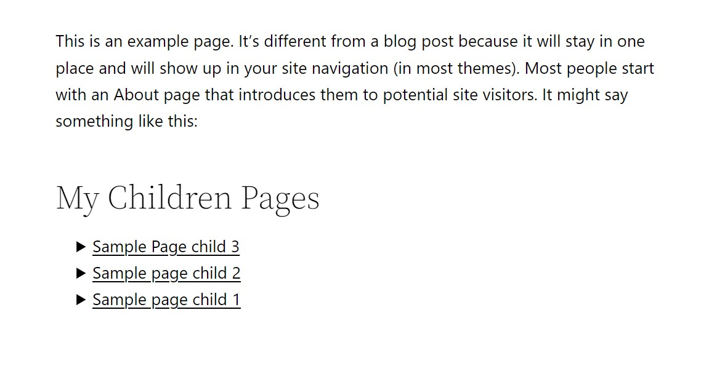

# WP List Children Pages
A WordPress plugin to list children pages or posts where ever needed via a shotcode. There are two types of views: List view and Card view. It is possible to exclude pages from the list by providing the page-id in the shortcode.

### Short code 
[list_children_pages title="My Children Pages(list view)" type="list" excluded_pages="43"]
[list_children_pages title="My Children Pages(card view)" type="card" excluded_pages="43"]

### Screenshot
#### list view

#### card view

